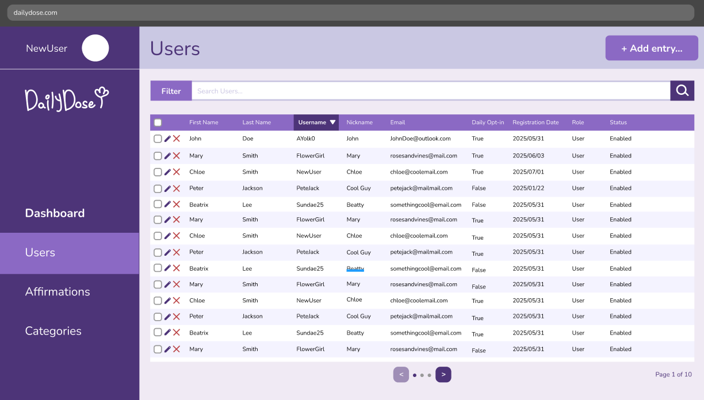

## Technical Prototyping & Automation
> Bridging the gap between theory and execution through API architecture, technical validation (PoC), and internal tool development to enhance system stability.

<a href="/cv/projects/wiz_local/" class="card-link">
  

    
    
WiZ Local Control Test (CLI)

    
#python #iot #protocol_test #automation

  

</a>

<a href="/cv/projects/dailydose/" class="card-link">
  

    
    
DailyDose (SaaS Backend)

    
#python #flask #rest_api #db_modeling

  

</a>

<a href="/cv/projects/carepilot/" class="card-link">
  

    
    
CarePilot (PoC Web App)

    
#python #fastapi #system_architecture

  

</a>

## Product Leadership & Ecosystems
> Orchestrating complex roadmaps, global partnerships, and scalable system architectures to drive business growth and cross-platform interoperability.

<a href="/cv/projects/wiz/" class="card-link">
  

    
    
WiZ Global IoT Ecosystem

    
#matter_protocol #global_partnership #iot

  

</a>

<a href="/cv/projects/igaming/" class="card-link">
  

    
    
Multi-Tenant iGaming Platform

    
#saas #scalability #system_overhaul

  

</a>

<a href="/cv/projects/smallsomebody/" class="card-link">
  

    
    
SmallSomebody (Data Initiative)

    
#open_data #sql #sdgs

  

</a>

<a href="/cv/projects/salasusu/" class="card-link">
  

    
    
SALASUSU (Global E-commerce)

    
#0_to_1 #cross_border #ux

  

</a>

