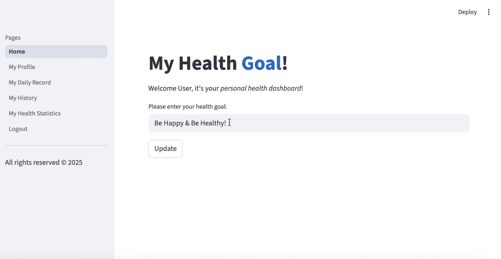
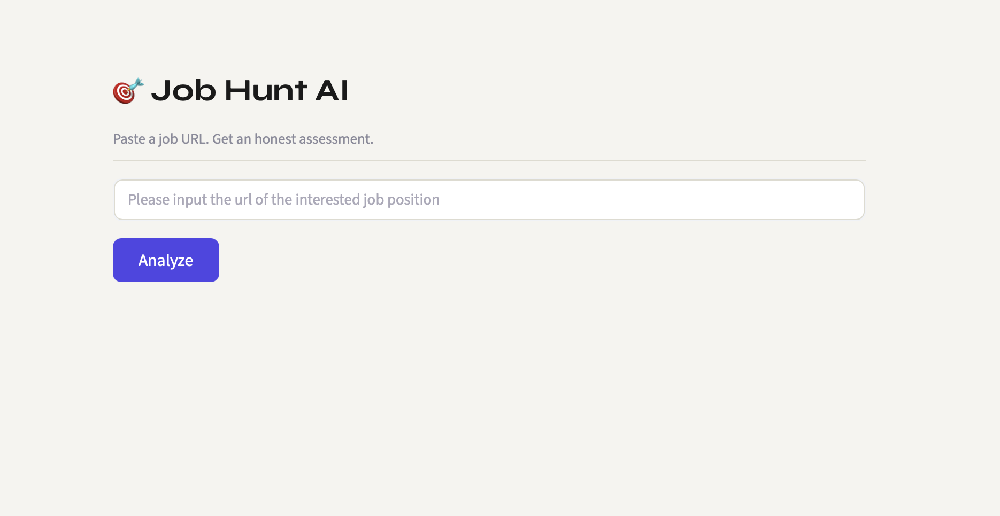
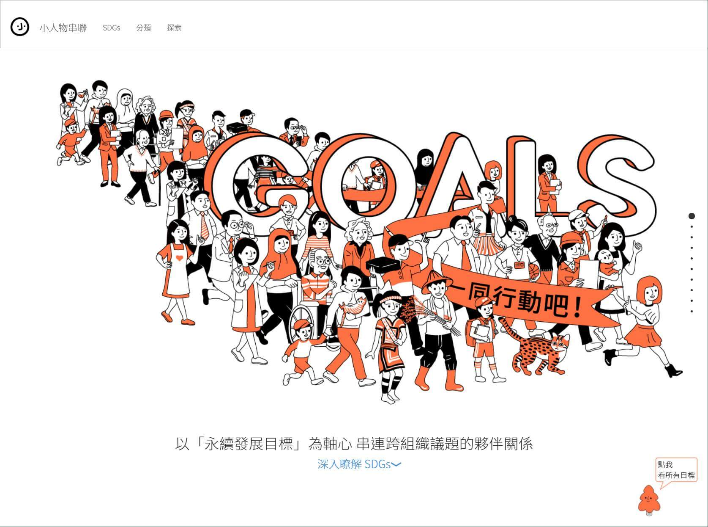
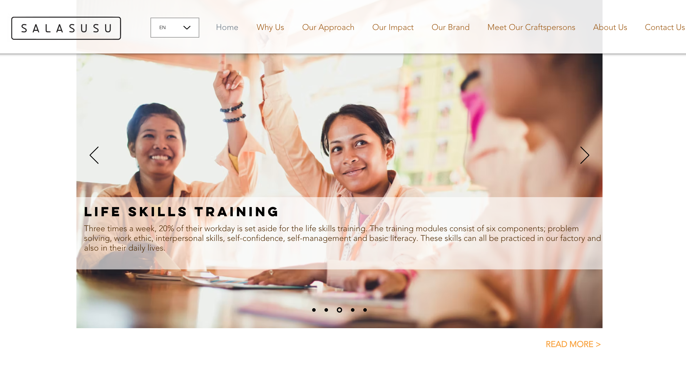

## Platform Product Leadership & Ecosystem
> Projects in this category focus on defining and owning platform-level strategy, ecosystem integration, and long-term system capabilities. The work emphasizes cross-functional leadership, partner alignment, and decision-making at the protocol, API, and platform architecture level.

  
<a href="/cv/projects/wiz/" class="card-link">
  

    
    
WiZ Global IoT Ecosystem

    
#matter #global_partnership #iot

  

</a>

<a href="/cv/projects/igaming/" class="card-link">
  

    
    
Multi-Tenant iGaming Platform

    
#saas #scalability #system_overhaul

  

</a>

## Hands-on Builds & Technical Validation
> This category highlights tools and prototypes built to validate system design, automate workflows, and explore protocol boundaries. These projects demonstrate how platform thinking translates into hands-on implementation — from CLI utilities to AI-powered pipelines.

<a href="/cv/projects/wiz_local/" class="card-link">
  

    
    
WiZ Local Control Test (CLI)

    
#python #protocol_test #automation

  

</a>

<a href="/cv/projects/carepilot/" class="card-link">
  

    
    
CarePilot (PoC Web App)

    
#python #fastapi #system_architecture

  

</a>

<a href="/cv/projects/joblens/" class="card-link">
  

    
    
JobLens AI Assistant

    
#python #fastapi #llm #automation

  

</a>

## Social Impact Projects
> Projects built in collaboration with NGOs, social enterprises, and civic communities. These represent product work driven by mission over margin — translating real-world constraints into functional digital products with measurable social outcomes.

<a href="/cv/projects/smallsomebody/" class="card-link">
  

    
    
SmallSomebody (Data Initiative)

    
#open_data #sql #sdgs

  

</a>

<a href="/cv/projects/salasusu/" class="card-link">
  

    
    
SALASUSU (Global E-commerce)

    
#0_to_1 #cross_border #ux

  

</a>

