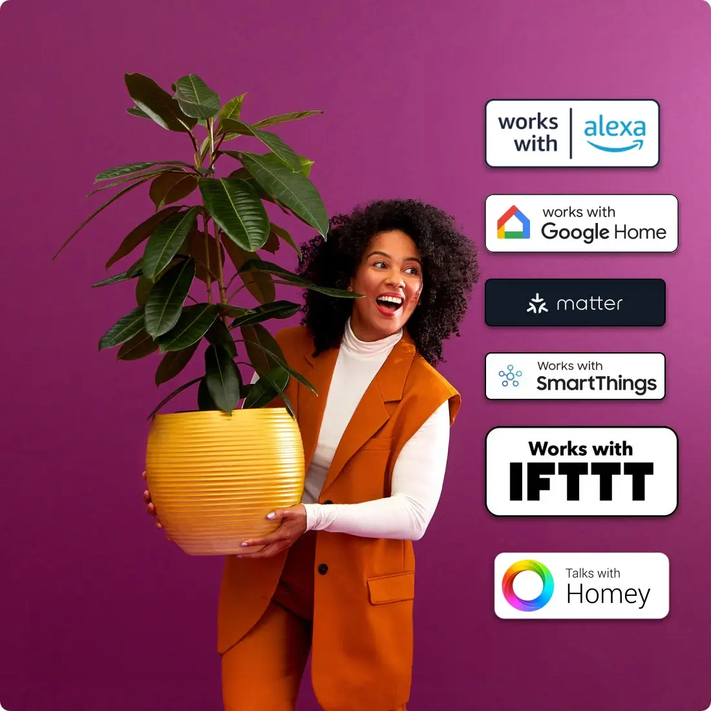
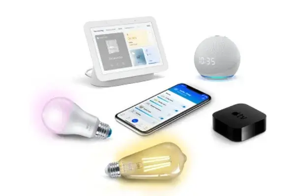
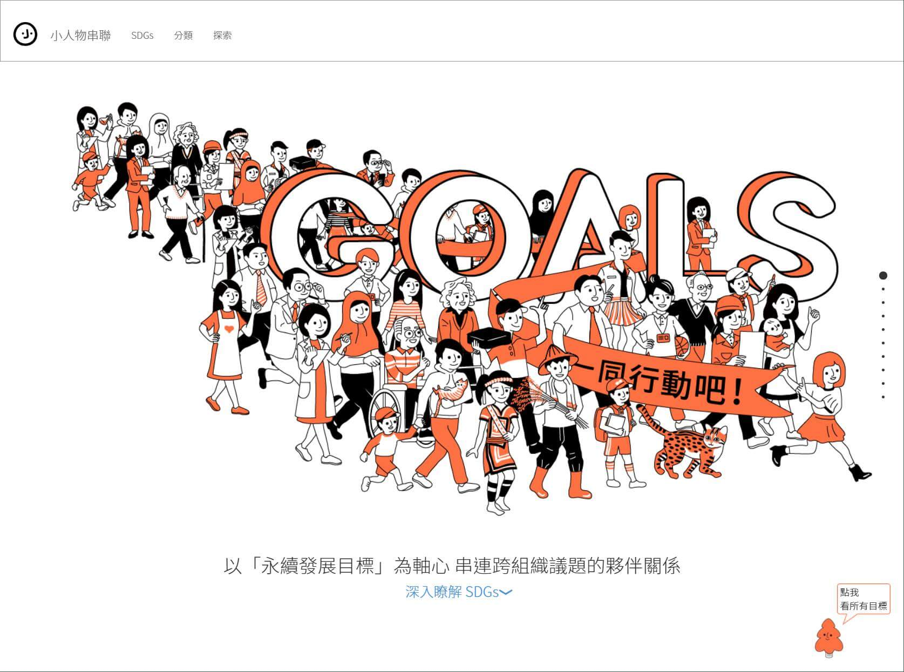

## Platform Product Leadership & Ecosystem
> Projects in this category focus on defining and owning platform-level strategy, ecosystem integration, and long-term system capabilities. The work emphasizes cross-functional leadership, partner alignment, and decision-making at the protocol, API, and platform architecture level.

  
<a href="/cv/projects/wiz/" class="card-link">
  

    
    
WiZ Global IoT Ecosystem

    
#matter_protocol #global_partnership #iot

  

</a>

<a href="/cv/projects/igaming/" class="card-link">
  

    
    
Multi-Tenant iGaming Platform

    
#saas #scalability #system_overhaul

  

</a>

## Platform Prototypes & Technical Exploration
> This category highlights platform-oriented prototypes built to validate system design, data models, and technical assumptions. These projects explore how scalable platform capabilities can be shaped through hands-on experimentation and early architectural decisions.

<a href="/cv/projects/wiz_local/" class="card-link">
  

    
    
WiZ Local Control Test (CLI)

    
#python #iot #protocol_test #automation

  

</a>

<a href="/cv/projects/carepilot/" class="card-link">
  

    
    
CarePilot (PoC Web App)

    
#python #fastapi #system_architecture

  

</a>

## Experimental & Independent Projects
> These projects represent smaller-scale product experiments and independent explorations across different domains. They demonstrate adaptability, rapid learning, and the ability to translate ideas into functional products, even outside formal platform environments.

<a href="/cv/projects/smallsomebody/" class="card-link">
  

    
    
SmallSomebody (Data Initiative)

    
#open_data #sql #sdgs

  

</a>

<a href="/cv/projects/salasusu/" class="card-link">
  

    
    
SALASUSU (Global E-commerce)

    
#0_to_1 #cross_border #ux

  

</a>

<a href="/cv/projects/dailydose/" class="card-link">
  

    
    
DailyDose (SaaS Backend)

    
#python #flask #rest_api #db_modeling

  

</a>

