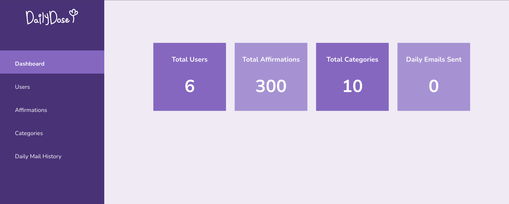

## Project Overview

> Empowering Well-being Through Personalized Affirmations

DailyDose is a full-featured web application designed to promote mindfulness and emotional well-being through personalized daily affirmations and community-driven features. This project was conceived and developed during the **freeCodeCamp Hackathon in July 2025**, a demanding challenge with a tight **four-week delivery timeline**. Our international team, newly assembled for the hackathon, collaborated remotely to build this platform from the ground up, culminating in a fully functional application complete with a robust admin system.

## Team & My Role

This project involved a distributed, international team:

- Front-end Developers: 5
- Back-end Developers: 4 (including myself)

As a Backend Developer, my primary responsibilities centered on designing and implementing core server-side functionalities, ensuring data integrity, and facilitating seamless interaction with the frontend.

## Challenges

Delivering a comprehensive web application with an integrated admin system within a **mere four-week timeframe** presented significant challenges:

- **Rapid Cross-Functional Collaboration**: Working effectively with a newly assembled and geographically dispersed international team, establishing efficient communication channels, and aligning diverse workflows under extreme time pressure.

- **Aggressive Project & Codebase Management**: Designing, grooming, and validating both the project scope and the codebase with stringent deadlines. This required identifying optimal solutions or creatively developing workarounds to ensure successful delivery without compromising core functionality or scalability.

## Tech Stacks & My Contribution
This project leveraged a modern web development stack to ensure robustness and scalability.


- **Virtual Environment**: uv
- **Database**: PostgreSQL (SQLlite for testing)
- **Back-end**: Flask, sqlalchemy
- **Front-end**: Jinja, CSS, JavaScript
- **DevOps & Version Control**: Docker, Git

### My Key Contribution

- **Core Backend Module Delivery**: I was directly responsible for developing and delivering the `controllers/user_settings.py`, `controllers/admin/user.py` and `controllers/admin/dashboard.py` modules. These were critical for managing user accounts, providing basic data analytics and administrative functionalities.

- **Fundamental User Operations**: Implemented core CRUD (Create, Read, Update, Delete) functionalities for user accounts, laying the foundation for all user-related interactions.

- **Password Reset Flow (Partial)**: Developed a partial of the password reset mechanism, ensuring secure user access and account recovery.

- **Project Management & Integration Testing**: Contributed actively to project management efforts, including task breakdown and progress tracking. Additionally, I designed and executed integration tests to ensure seamless interaction between backend modules and the frontend.

**Project Structure (Relevant Backend Components I worked on)**

```
indigo-class/
├── app/
│   ├── __init__.py          # Flask app factory
│   ├── controllers/
│   │   ├── root.py          
│   │   ├── auth.py          
│   │   ├── affirmations.py  
│   │   ├── categories.py    
│   │   ├── user.py          # User blueprint and routes  --> My Contribution
│   │   └── admin/                                        
│   │       ├── dashboard.py # Admin dashboard blueprint and routes  --> My Contribution
│   │       └── user.html    # User management blueprint and routes  --> My Contribution
│   ├── static/               
│   └── templates/           
│       ├── base.html     
│       ├── _header.html      
│       ├── _footer.html      
│       ├── home/
│       │   ├── index.html        
│       │   └── dashboard.html   
│       ├── auth/
│       │   ├── register.html                  
│       │   ├── login.html                     
│       │   ├── reset_password_request.html    
│       │   ├── new_password.html             
│       │   └── user_settings.html             
│       ├── affirmations/
│       │   ├── index.html   
│       │   ├── add.html      
│       │   └── edit.html    
│       ├── categories/
│       │   ├── list.html     
│       │   ├── add.html      
│       │   └── edit.html     
│       └── admin/
│           ├── dashboard.html       
│           ├── users.html           
│           ├── affirmations.html   
│           ├── categories.html     
│           ├── analytics.html       
│           └── settings.html        
├── main.py                   
├── pyproject.toml           
├── Dockerfile                
├── docker-compose.yml        
└── README.md                 
```

> [GitHub project: indigo-class/DailyDose ](https://github.com/freeCodeCamp-2025-Summer-Hackathon/indigo-class)


## Software Development Life Cycle 
As a hackathon project, we adopted agile and iterative development methodologies to meet the demanding timeline.

### Initiation
- Requirement Definition: Based on the hackathon theme and team discussions, we defined the core functionalities of DailyDose, focusing on daily affirmations, user management, and basic data analytics.

- Project Planning: We rapidly defined the scope of the MVP (Minimum Viable Product) and conducted initial task assignments and timeline estimations.

### Planning
- Tech Stack Selection: Collaboratively, we decided to use Flask as the backend framework and PostgreSQL as the database, leveraging their lightweight and efficient characteristics for rapid development.

- Architecture Design: We planned the application's modular structure, clearly defined the API interfaces between the frontend and backend, and designed the database's relational model.

- Task Breakdown: Main functionalities were broken down into manageable tasks, and version control systems were used for collaboration.

### Development & Problem-solving
- Collaborative Development: I was primarily responsible for implementing backend controllers and core business logic, coordinating with other backend developers on our respective modules.

- Problem-Solving: Throughout the development process, we rapidly identified and resolved issues such as inconsistencies in cross-team API collaboration and database query optimization, ensuring development progress.

### Release & Deployment
- Containerization: We utilized Docker and docker-compose.yml to define our development and deployment environments, ensuring consistency and rapid deployment.

- Deployment: The team collaboratively deployed the application to the designated cloud platform, ensuring its accessibility.

### Metric Review & Iteration
- Feature Validation: After the project concluded, we conducted internal feature validation and user testing to ensure all core functionalities were running as expected.

- Readiness for Iteration: Although the hackathon had a clear delivery endpoint, we considered future scalability during development, laying the groundwork for potential subsequent iterations.

## Achievements

- **Accelerated Backend Development**: Successfully delivered critical backend modules, including admin user, admin dashboard, and user settings controllers, entirely from scratch within an extremely compressed timeline, ensuring modularity and maintainability for future expansions.

- **Scalable Architecture Design**: Contributed to the design and implementation of a scalable backend architecture using Flask and SQLAlchemy, which facilitated smooth integration with frontend templates and provides a robust foundation for future feature expansion.

- **Effective Remote Team Coordination**: Played a key role in coordinating backend development efforts across a newly formed, international team. This involved actively aligning workflows, facilitating communication, and proactively resolving technical blockers to ensure the project met its tight deadlines.

- **End-to-End Project Understanding**: Gained invaluable experience in rapid full-stack development within a hackathon setting, deepening my understanding of the entire SDLC from initial concept to deployment and iteration.

<div class="card-grid">

  <a href="./" class="card-item-wrapper"> <div class="card-image">
      
      <div class="caption"> DailyDose App View</div>
      <div class="tags"> #user_view </div>
    </div>
  </a> <a href="./" class="card-item-wrapper"> <div class="card-image">
      
      <div class="caption">User Stories</div>
      <div class="tags">#ux </div>
    </div>
  </a> </div>
