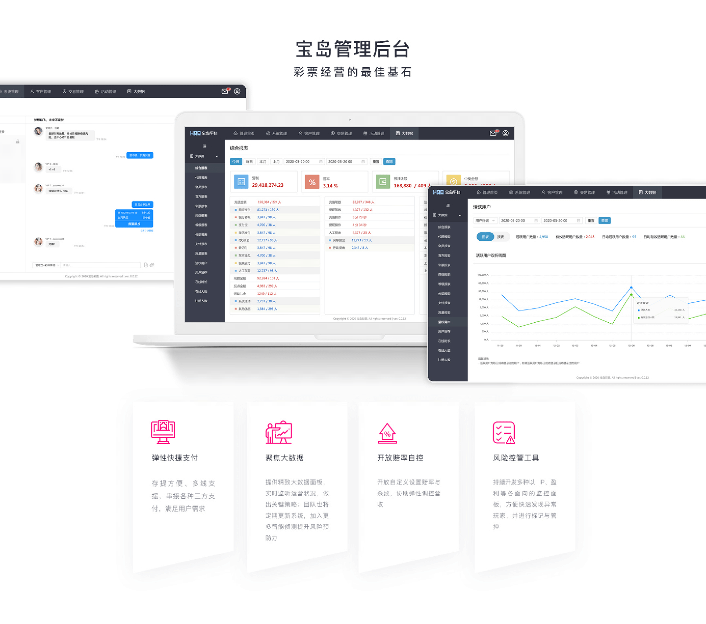

## Project Overview  

> iGaming SaaS Platform — Self-Hosted Lottery Solution for White Label Clients

Developed and launched a self-hosted lottery SaaS platform tailored for white-label clients, enabling rapid deployment of branded lottery operations. The product suite included user-facing web applications and administrative dashboards, designed to meet diverse operational needs in a competitive iGaming market.

---

## Team Composition & My Role  

| Role                     | Responsibility                                                  |
|--------------------------|------------------------------------------------------------------|
| **Product Managers (2, incl. myself)**     | Defined product vision, roadmap, and delivery strategy           |
| System Architect         | Designed scalable system architecture                           |
| Frontend Engineers (3)   | Built responsive UI and client-facing features                   |
| Backend Engineers (3)    | Developed core logic, APIs, and integrations                     |
| UI/UX Designers (2)      | Created wireframes, prototypes, and design systems               |

As Product Manager, I led the full product lifecycle—from strategy and discovery to development, testing, and optimization—ensuring alignment with business goals and client needs.

---

## Key Challenges & Solutions  

- **White Label Feature Set**：Designed a modular product kit with customizable front-end and admin tools for diverse client use cases  
- **Tight Market Timeline**：Delivered MVP under aggressive deadlines to secure early market entry and client adoption  

---

## Key Contributions & Impact  

- **End-to-End Product Leadership**：Oversaw planning, development, and testing of core modules including payments, analytics dashboards, chat rooms, and admin tools  
- **Agile Execution**：Managed Scrum-based sprints, daily stand-ups, and PoC demos to ensure timely MVP delivery and iterative improvements  
- **Quality Assurance**：Led performance testing and QA cycles to ensure scalability and reliability across all components  
- **Bug Resolution**：Implemented Kanban workflows for efficient issue tracking and resolution  
- **Operational Efficiency**：Achieved a 15% improvement in client operations post-launch through optimized platform design  

---

## Software Development Lifecycle  

| Phase                   | Key Activities                                                                 |
|-------------------------|--------------------------------------------------------------------------------|
| **Initiation**          | - Defined MVP scope for user/admin panels - Outlined requirements for dashboards & chat |
| **Planning**            | - Built roadmap & prioritized backlog by business value & feasibility - Led sprint planning (Scrum) - Collaborated on scalable architecture with engineers |
| **Development & Testing** | - Conducted daily stand-ups for progress tracking - Oversaw development of auth, payments, dashboards, chat, admin tools - Used Kanban for bug tracking - Led QA: functional, integration, performance testing |
| **Release & Deployment** | - Delivered MVP on schedule - Enabled early client onboarding & feedback loop |

  <a href="./" class="card-item-wrapper"> 

      
      
 App View

      
 #app 

    

  </a> <a href="./" class="card-item-wrapper"> 

      
      
User Journey

      
#ux 

    

  </a> 

