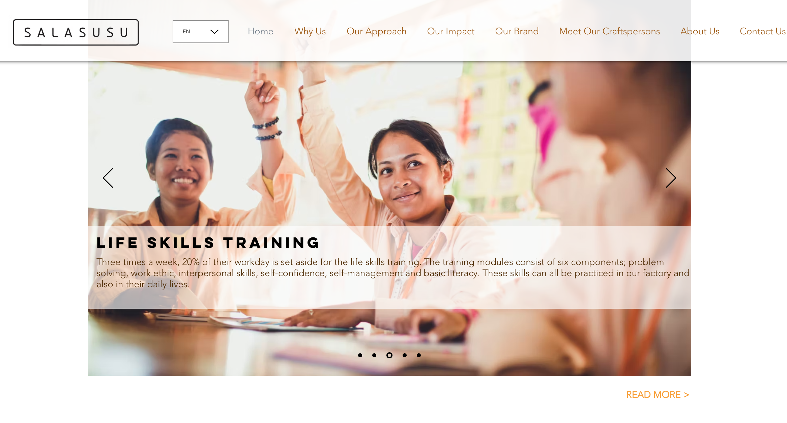
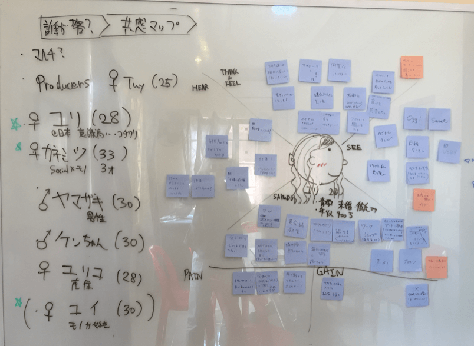

## Project Overview

> Empowering Cambodian Young Women Through E-commerce Expansion

This initiative was a ground-up effort aimed at significantly expanding the reach and impact of SALASUSU, a Japanese social enterprise dedicated to empowering young women in Cambodia through education and sustainable livelihoods. I was invited to join as a volunteer to contribute to the strategic planning and hands-on execution of a new e-commerce platform. The goal was clear: accelerate growth, promote the organization's sustainable impact, and connect their handcrafted products with a broader global audience.

My core responsibility was to oversee the development of this new e-commerce platform. This involved defining detailed specifications, crafting intuitive wireframes, conducting empathy mapping to deeply understand user needs, and applying targeted SEO strategies to enhance online visibility and engagement, ultimately driving sales and amplifying the social mission.

## Team & My Role
This project involved a lean, cross-functional team, augmented by external expertise, where I played a pivotal role in product and user experience.

- Marketing Manager: 1
- Product Owner: 1 (Myself)
- Fullstack Engineer: 1
- Outsourced UI/UX Design Team: 1 (External)

As the Product Owner, I was instrumental in bridging the gap between the social mission and digital execution. My role encompassed defining product vision,  wireframing, ensuring user-centric design, and coordinating cross-functional efforts to bring the platform to life.

## Challenges

Launching this e-commerce platform from scratch presented several unique and complex challenges:

- **Building from Zero with Unfamiliar Ecosystems**: The entire project was built without prior experience in integrating with Japanese e-commerce services or payment gateways, requiring extensive research and adaptation.
- **Balancing Commercial & Social Impact Goals**: Striking a delicate balance between achieving commercial sales targets and staying true to SALASUSU's NGO-driven social mission, ensuring the platform effectively served both purposes.
- **Audience Expansion & Sales Promotion**: Developing effective strategies to reach a wider international audience (SEO, Advertising) and drive sales for handmade products, while conveying the unique social value proposition.

## My Contribution

- **Product Vision & Specification**: Defined comprehensive product specifications and user stories, translating business requirements and social mission goals into actionable development tasks.
- **User Experience (UX) Design**: Led the entire UX process, including conducting empathy mapping to gain deep insights into user behaviors and needs, and creating detailed wireframes to guide the UI design and development.
- **SEO Strategy & Implementation**: Developed and implemented strategic SEO plans to significantly strengthen the platform's online visibility and organic search ranking, directly contributing to audience engagement. 

## Achievements

- **Successful Platform Launch & Positive Feedback**: Successfully launched the new e-commerce platform on schedule, receiving overwhelmingly positive feedback from users and partners for its usability and effectiveness.
- **Enhanced Online Visibility & Engagement**: Through strategic SEO implementation and user-centric design, significantly strengthened SALASUSU's online visibility and engagement, expanding its reach beyond previous limitations.
- **Bridged Commercial & Social Missions**: Effectively designed a platform that balanced commercial goals with the organization's NGO-driven impact, demonstrating a deep understanding of social enterprise models.

  

 
