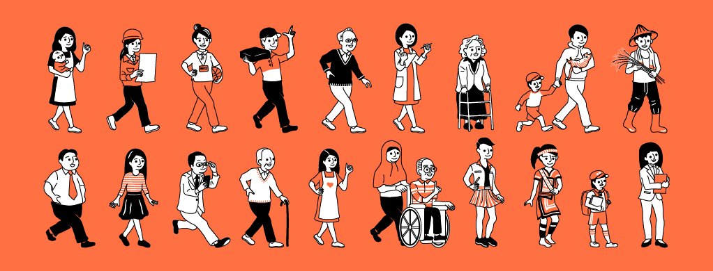

## Project Overview

> Connecting Taiwan's NGOs & NPOs through Open Data

SmallSomebody is an open-data initiative designed to connect Non-Profit Organizations (NPOs) and Non-Governmental Organizations (NGOs) across Taiwan. Our core mission is to empower these smaller organizations, ensuring their voices are heard, fostering connections among them, and amplifying their collective social impact. By transparently presenting their data, we aim to break down information silos, promote resource sharing and collaboration, and ultimately support the broader Sustainable Development Goals (SDGs) agenda.

## Team & My Role

This project was driven by a lean, cross-functional team:

- Product Manager / UX Lead: 1 (Myself)
- Fullstack Engineer: 1
- Frontend Engineer: 1
- Marketing & Operations: 1
- Graphic Designer: 1

As the Product Manager and UX researcher, I spearheaded the project from user research, and product planning to promotion and operations, ensuring a tight alignment between project goals and user needs.

## Challenges
Developing the SmallSomebody project presented several significant challenges:

- **Data Collection & Input Barrier**: Effectively and conveniently gathering data from NPOs/NGOs across Taiwan, and designing a user-friendly mechanism for them to easily input their own organizational information onto our website.
- **Promoting SDG Concepts**: Communicating the abstract concepts of Sustainable Development Goals (SDGs) in an engaging and easily understandable manner to the general public, and attracting more attention to relevant organizations and issues.
- **Resource & Visibility Constraints**: Operating as a small, open-source side project, effectively raising our own project's visibility, as well as that of the organizations we support, with limited resources.

## Tech Stack & My Contribution
The project leveraged an open-source technology stack, combined with a flexible content management system, to enable rapid development and efficient operations.

- **Content Management System (CMS)**: Drupal
- **Database Integration**: MySQL linked with Airtable (for content operations)
- **Frontend Framework**: Bootstrap (for responsive design)

### My Key Contributions

- **User Experience Design**: Planned and facilitated UX workshops, including Empathy Mapping and Persona Creation, to ensure the platform's design met the real needs of both NPOs/NGOs and general users.
- **Content Operations Streamlining**: Streamlined the process for collecting, managing, and publishing organizational data by integrating Airtable with MySQL, significantly improving content operation efficiency.
- **Promotion & Community Growth**: Organized and hosted SDGs board game workshops and actively participated in open-sharing events to gain traction, contributing to a 45% growth in Facebook followers and monthly active users.
- **Project Management & Cross-Functional Coordination**: Responsible for overseeing product development progress and coordinating collaboration among team members (fullstack, frontend, marketing, design), ensuring smooth project execution.

## Software Development Life Cycle 
As a social enterprise side project, we adopted a lightweight, highly collaborative agile development model, emphasizing community engagement and impact dissemination.

### Initiation

- **Problem Definition**: Identified the challenges faced by small NPOs/NGOs regarding low visibility and dispersed resources, and proposed an open-data platform as a solution.
- **Vision Establishment**: Clearly defined the project's vision to serve as a bridge connecting Taiwan's NPOs/NGOs and promoting SDG concepts.

### Planning

- **Tech Stack Selection**: Chose Drupal as the core CMS for its open-source nature and content management flexibility, and introduced Airtable to simplify data management for non-technical users.
- **User Research**: Conducted user research, utilizing empathy mapping and persona creation, to deeply understand the needs of NPOs/NGOs and the behavior patterns of potential platform users.
- **MVP Definition**: Prioritized the development of core functionalities, such as organization listing, search, and basic categorization, to enable quick launch and validation of user needs.

### Development & Testing

- **Iterative Development**: Worked closely with the engineers to develop website functionalities in agile iterations, continuously conducting internal testing and gathering feedback.
- **UX Testing & Optimization**: Integrated user testing throughout the development process. Based on practical feedback from NPOs/NGOs, continuously optimized the website's data input interface and user experience flows.
- **Content Model Design**: Designed Drupal's content types and fields to support the rich and structured display of NPO/NGO information, ensuring seamless data synchronization with Airtable.

### Release & Promotion

- **Website Launch**: Coordinated the website's deployment and official launch.
- **Promotional Activities**: Actively participated in external open-data communities and social enterprise events, and hosted SDG-related workshops to promote the platform and attract NPOs/NGOs.
- **Community Operations**: Utilized social media platforms like Facebook for content publishing and interaction, expanding the project's reach.

### Metric Review & Iteration

- **Data Tracking**: Monitored key metrics such as website traffic, user behavior, and the number of NPOs/NGOs onboarded.
- **Feedback Mechanism**: Established a mechanism for collecting direct feedback from NPOs/NGOs and general users to inform future feature optimizations and content updates.
- **Continuous Improvement**: Continuously iterated on product functionalities and promotion strategies based on data and feedback, for example, optimizing search functions or adding new interactive modules.

## Achievements

- **Enhanced Organizational Visibility**: Successfully empowered more small NPOs/NGOs to gain exposure, addressing their long-standing challenge of limited visibility.
- **SDG Education Dissemination**: The platform was adopted by numerous school teachers as a teaching tool to educate students on SDG concepts, effectively promoting the popularization and understanding of sustainable development issues.
- **Community & User Growth**: Driven by marketing and operational strategies, achieved a significant 45% growth in Facebook followers and monthly active users.
- **Efficient Operational Model Establishment**: Established efficient content management and data collaboration workflows by integrating Drupal, MySQL, and Airtable, demonstrating the ability to leverage technology to solve real-world problems with limited resources.

  <a href="./" class="card-item-wrapper"> 

      
      
 UX Questionnaire

      
 #ux 

    

  </a> <a href="./" class="card-item-wrapper"> 

      
      
Smallsomebody Sitemap

      
#ux 

    

  </a> 

