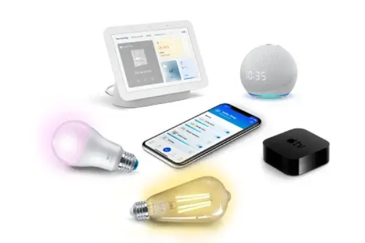

## Project Overview  

> WiZ Local Control Test Script — UDP-Based Smart Lighting Validation Tool

As a Product Manager for WiZ's API services, I managed the end-to-end integration of smart lighting solutions, covering both cloud and local control protocols. My responsibilities included providing technical support to external partners, defining feature requirements, and facilitating integration processes. A recurring challenge during PoC (Proof-of-Concept) and partner validation was the absence of a lightweight, reliable tool for testing local command protocols, especially for developers aiming to build pure local controllers.

To address this critical gap, I independently designed and developed the WiZ Light Local Test Script. This Python-based CLI utility enables UDP-based local communication to validate local control protocols for WiZ smart lighting devices.


**Note:** This project was developed for personal use during my tenure at WiZ and was not formally shared externally. Post-employment, I expanded and modularized it for broader applicability and maintainability.

---

## Role & Scope  
Sole developer and product owner of the project. Led the full lifecycle from problem identification and technical design to implementation, testing, and post-employment refactoring.

---

## Key Challenges & Solutions  

- **Tooling Gap for Local Testing**：Built a lightweight, cloud-independent utility to validate local control commands during PoC and partner integration  
- **Protocol Complexity**：Abstracted device types and command flows to simplify UDP-based testing for developers  
- **Maintainability & Extensibility**：Refactored into a modular architecture post-employment to support broader use cases and long-term maintainability  

---

## Key Contributions & Impact  

- **End-to-End Development**：Built CLI tool with UDP communication, test runner, and device-type abstraction modules  
- **Test-Driven Approach**：Implemented pytest-based automated tests to ensure reliability and correctness of command execution  
- **Modular Architecture**：Refactored codebase into reusable modules for enhanced scalability across device types and testing scenarios  
- **Documentation & Enablement**：Provided clear usage examples and README to support internal and external adoption  
- **Operational Efficiency**：Streamlined partner validation workflows and clarified protocol boundaries for WiZ smart lighting products  

---

## Software Development Lifecycle  

| Phase                   | Key Activities                                                                 |
|-------------------------|--------------------------------------------------------------------------------|
| **Initiation**          | - Identified lack of local testing tools<br>- Proposed Python CLI solution |
| **Planning**            | - Designed core modules: UDP, runner, type abstraction<br>- Prioritized key features |
| **Development & Testing** | - Built iteratively with pytest integration<br>- Validated packet construction and device responses |
| **Release & Deployment** | - Published tool with documentation<br>- Refactored post-employment for modularity |
| **Iteration & Impact**   | - Continued refinement based on usage<br>- Improved adaptability for PoC and QA environments |


### Project Structure
The tool follows a modular architecture for maintainability and extensibility:

```
 wiz-light-local-test-script
｜＿＿ modules/                 # Core logic: UDP communication, test runner, device abstraction
｜    ｜＿＿ __init__.py      
｜    ｜＿＿ communication.py    # Build the udp connection, send and receive the udp packet
｜    ｜＿＿ runner.py           # Run the test cases
｜    ｜＿＿ type_data.py        # Test cases based on different device types
｜＿＿ pytest/ 
｜    ｜＿＿ tests/
｜    ｜   ｜＿＿ conftest.py
｜    ｜   ｜＿＿ test_basic.py
｜    ｜＿＿ pytest.ini
｜＿＿ simple_scripts
｜    ｜＿＿ basic_refactor.py
｜    ｜＿＿ basic.py
｜＿＿ cli.py                    # CLI entry point
｜＿＿ app.py                    # Optional Streamlit GUI
｜＿＿ README.md
```

**GitHub Repository**: [Local Control Test Script for WiZ Lights](https://github.com/maudes/wiz-light-local-test-script)

<br>
