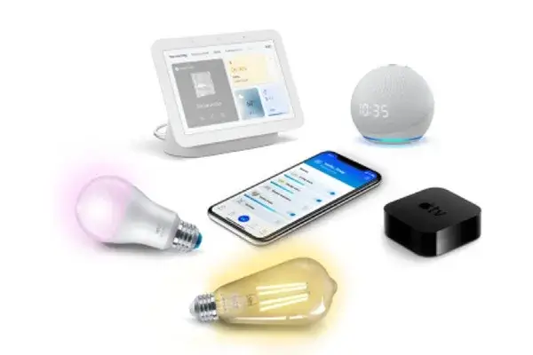

## Project Overview  

> WiZ Local Control Test Script — UDP-Based Smart Lighting Validation Tool

As the Product Manager for WiZ's API services, I managed the end-to-end integration of smart lighting solutions across cloud and local control protocols. During partner validation, external developers lacked a lightweight, reliable tool to test local command protocols for pure local controllers. Concurrently, regional sales teams needed a zero-cloud solution to power live demos—such as a Chinese customer deploying setups across hundreds of nationwide showrooms, US roadshows, and EU retail shops.

Because official engineering resources were constrained, this high-impact utility could not be prioritized on the main roadmap. Recognizing its strategic value, I independently designed and developed this Python-based CLI utility to enable UDP-based local communication and validate WiZ smart lighting protocols.

**Note:** Originally built as an internal tool to unblock partners and regional sales teams, I have post-employment expanded and modularized the project for broader, open-source maintainability.

### Why the tool?
External API partners were stalled during PoC due to a lack of local testing environments, while regional sales pipelines,especially EU retail channels, were losing momentum without a stable demo tool that could survive poor in-store networks. With corporate engineering tied up, stepping in as a solo developer to build a lightweight, functional prototype was the fastest way to validate the protocol for partners and deliver an immediate stopgap for high-stakes commercial deployments.

### Trade-offs
Regional requests initially leaned toward a complex, feature-rich hardware config board, but this was slow to build and ill-suited for unstable retail environments. I chose to prioritize a software-only, "pro-EU" design instead. This allowed us to leverage existing factory tools rather than building hardware from scratch, directly securing the EU sales pipeline. Because the resulting Python tool was lightweight and portable, it easily scaled to meet the basic operational needs of both the US roadshows and the massive Chinese showroom rollout with zero extra development cost.

---

## Role & Scope  
Sole developer and product owner of the project. Led the full lifecycle from problem identification and technical design to implementation, testing, and post-employment refactoring.

---

## Key Challenges & Solutions  

- **Tooling Gap for Local Testing**：Built a lightweight, cloud-independent utility to validate local control commands during PoC and partner integration  
- **Protocol Complexity**：Abstracted device types and command flows to simplify UDP-based testing for developers  
- **Maintainability & Extensibility**：Refactored into a modular architecture post-employment to support broader use cases and long-term maintainability  

---

## Key Contributions & Impact  

- **End-to-End Development**：Built CLI tool with UDP communication, test runner, and device-type abstraction modules  
- **Test-Driven Approach**：Implemented pytest-based automated tests to ensure reliability and correctness of command execution  
- **Modular Architecture**：Refactored codebase into reusable modules for enhanced scalability across device types and testing scenarios  
- **Documentation & Enablement**：Provided clear usage examples and README to support internal and external adoption  
- **Operational Efficiency**：Streamlined partner validation workflows and clarified protocol boundaries for WiZ smart lighting products  

---

## Software Development Lifecycle  

| Phase                   | Key Activities                                                                 |
|-------------------------|--------------------------------------------------------------------------------|
| **Initiation**          | - Identified lack of local testing tools<br>- Proposed Python CLI solution |
| **Planning**            | - Designed core modules: UDP, runner, type abstraction<br>- Prioritized key features |
| **Development & Testing** | - Built iteratively with pytest integration<br>- Validated packet construction and device responses |
| **Release & Deployment** | - Published tool with documentation<br>- Refactored post-employment for modularity |
| **Iteration & Impact**   | - Continued refinement based on usage<br>- Improved adaptability for PoC and QA environments |


### Project Structure
The tool follows a modular architecture for maintainability and extensibility:

```
 wiz-light-local-test-script
｜＿＿ modules/                 # Core logic: UDP communication, test runner, device abstraction
｜    ｜＿＿ __init__.py      
｜    ｜＿＿ communication.py    # Build the udp connection, send and receive the udp packet
｜    ｜＿＿ runner.py           # Run the test cases
｜    ｜＿＿ type_data.py        # Test cases based on different device types
｜＿＿ pytest/ 
｜    ｜＿＿ tests/
｜    ｜   ｜＿＿ conftest.py
｜    ｜   ｜＿＿ test_basic.py
｜    ｜＿＿ pytest.ini
｜＿＿ simple_scripts
｜    ｜＿＿ basic_refactor.py
｜    ｜＿＿ basic.py
｜＿＿ cli.py                    # CLI entry point
｜＿＿ app.py                    # Optional Streamlit GUI
｜＿＿ README.md
```

**GitHub Repository**: [Local Control Test Script for WiZ Lights](https://github.com/maudes/wiz-light-local-test-script)


<div style="text-align: center;">
  
</div>
<br>
